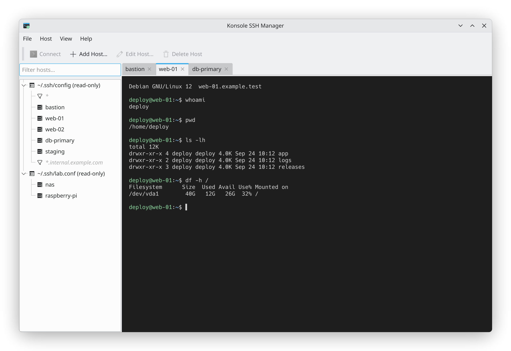

# Konsole SSH Manager

A KDE Plasma desktop app that manages SSH host profiles and opens them as embedded Konsole terminals: a sidebar with your hosts (grouped, filterable) and a tab per SSH session.



*The screenshot shows fictional demo hosts only.*

- Reads your `~/.ssh/config` (including `Include`d files) and shows those hosts read-only. You can import them.
- Hosts you create live in their own file, `~/.ssh/config.d/konsole-ssh-manager.conf`. Your handwritten config is never rewritten. The only change the app will ever make to `~/.ssh/config` is adding `Include config.d/*` at the top, and only after you confirm.
- Edits are lossless: comments, formatting and unknown options are preserved. Files are written atomically with `0600` permissions, and one backup is made per session in `~/.local/share/konsole-ssh-manager/backups/`.
- Entries are validated with `ssh -G`, and "Show Effective Settings" displays what OpenSSH will actually use for a host.
- Sessions run as `ssh <alias>`. If a connection fails, the tab stays open showing ssh's error until you press Enter. No passwords are stored; use keys and ssh-agent.

## Supported platforms

| Release | Qt / KDE Frameworks |
|---|---|
| Debian 12 (bookworm) | Qt 5.15 / KF5 |
| Debian 13 (trixie) | Qt 6 / KF6 |

Linux only. Konsole and the OpenSSH client must be installed at runtime.

## Build and run

```bash
make deps     # install build dependencies for your Debian release (sudo apt)
make build    # configure and build into ./build
make test     # run the test suite
make run      # start the app from the build directory
make install  # install for your user: ~/.local/bin + application menu entry
make uninstall # remove the installed files for your user
```

`make help` lists all targets. By default CMake picks Qt 6 when Qt 6 and KF6 are available and falls back to Qt 5. To force a version, use `make rebuild QT_MAJOR_VERSION=5` (or `6`). There is no `.deb` package; the install is per-user and needs no root access.

## TODO

- [ ] Refactor all the documentation to match the latest app behavior and features

## Contributing

Read [AGENTS.md](AGENTS.md) and the specs in [`docs/00 specs/`](docs/00%20specs/) before making changes. Changes must build and pass `make test` on both Debian 12 and Debian 13, and code is formatted with `make format`.
